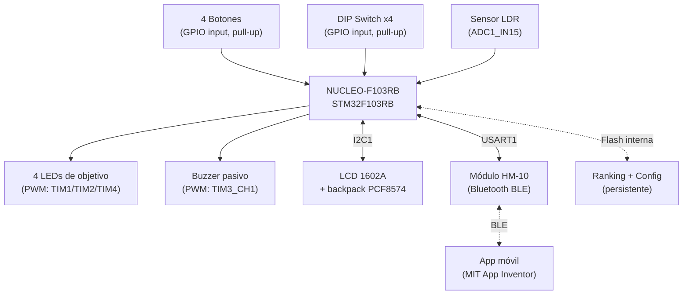
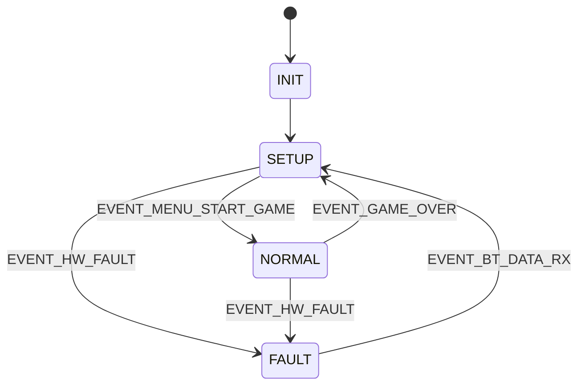

  

# Memoria del trabajo final: "Whack-A-Mole" — Juego Electrónico de Reflejos y Objetivos Aleatorios

<table align="center">
  <tr>
    <th>Autor</th>
    <th>Padrón</th>
    <th>Mail</th>
  </tr>
  <tr>
    <td>Labollita, Pedro</td>
    <td>112436</td>
    <td>[PENDIENTE: mail institucional]</td>
  </tr>
  <tr>
    <td>Masini, Marcos</td>
    <td>[PENDIENTE]</td>
    <td>[PENDIENTE]</td>
  </tr>

</table>

  2026 | 1er Cuatrimestre

  Taller de Sistemas Embebidos (TA134)

  Universidad de Buenos Aires | Facultad de Ingeniería

  [PENDIENTE: lugar y período de realización del trabajo]

---

# Resumen

Se desarrolló un sistema embebido de reflejos tipo "Whack-A-Mole" basado en una placa NUCLEO-F103RB, con arquitectura bare metal de tipo Event-Triggered, organizada en un super-loop con tick de 1 ms y un scheduler cooperativo de tareas. El sistema genera objetivos luminosos aleatorios que el jugador debe apagar antes de que expire un timeout decreciente, con tres niveles de dificultad, tres modos de operación (NORMAL, SET_UP, FALLA), menú interactivo navegable con los botones del juego, ranking persistente en flash interna, ajuste automático de brillo mediante sensor de luz (LDR + ADC), display LCD 1602A vía I2C, y comunicación Bluetooth Low Energy (módulo HM-10) hacia una aplicación desarrollada en MIT App Inventor, que permite recibir el score y configurar la dificultad de forma remota. El sistema implementa además un modo de bajo consumo (Sleep) activo en cada vuelta del super-loop.
 
Esta memoria documenta los requisitos, el diseño de hardware y firmware, los ensayos realizados (WCET, factor de uso de CPU, consumo, memoria utilizada) y el estado de cumplimiento de los requisitos originales.

---

# Registro de versiones

| Revisión | Cambios realizados | Fecha |
| :---: | --- | :---: |
| 0.1 | Esqueleto inicial de memoria (esta entrega) | 18/07/2026 |
| 1.0 | Memoria completa con mediciones de WCET, factor de uso de CPU, memoria y consumo parcial  | 09/08/2026 |

<em>Tabla 0.1 — Registro de versiones del documento.</em>

---

# Índice general

- [Capítulo 1: Introducción general](#capítulo-1-introducción-general)
  - [1.1. Selección del proyecto a implementar](#11-selección-del-proyecto-a-implementar)
  - [1.2. Proyectos similares](#12-proyectos-similares)
  - [1.3. Justificación del enfoque técnico](#13-justificación-del-enfoque-técnico)
  - [1.4. Alcance y limitaciones](#14-alcance-y-limitaciones)
- [Capítulo 2: Introducción específica](#capítulo-2-introducción-específica)
  - [2.1. Requisitos](#21-requisitos)
  - [2.2. Casos de uso](#22-casos-de-uso)
  - [2.3. Descripción de módulos principales](#23-descripción-de-módulos-principales)
- [Capítulo 3: Diseño e implementación](#capítulo-3-diseño-e-implementación)
  - [3.1. Hardware](#31-hardware)
  - [3.2. Firmware](#32-firmware)
- [Capítulo 4: Ensayos y resultados](#capítulo-4-ensayos-y-resultados)
  - [4.1. Pruebas funcionales de hardware](#41-pruebas-funcionales-de-hardware)
  - [4.2. Pruebas funcionales de firmware](#42-pruebas-funcionales-de-firmware)
  - [4.3. Pruebas de integración](#43-pruebas-de-integración)
  - [4.4. Circuito esquemático y cableado](#44-circuito-esquemático-y-cableado)
  - [4.5. Console and Build Analyzer](#45-console-and-build-analyzer)
  - [4.6. Medición y análisis de WCET por tarea](#46-medición-y-análisis-de-wcet-por-tarea)
  - [4.7. Cálculo del factor de uso de CPU (U)](#47-cálculo-del-factor-de-uso-de-cpu-u)
  - [4.8. Medición y análisis de consumo](#48-medición-y-análisis-de-consumo)
  - [4.9. Cumplimiento de requisitos](#49-cumplimiento-de-requisitos)
  - [4.10. Comparación con sistemas similares](#410-comparación-con-sistemas-similares)
- [Capítulo 5: Conclusiones](#capítulo-5-conclusiones)
- [Capítulo 6: Uso de herramientas de IA](#capítulo-6-uso-de-herramientas-de-ia)
- [Capítulo 7: Bibliografía y referencias](#capítulo-7-bibliografía-y-referencias)

---

# Capítulo 1: Introducción general

## 1.1. Selección del proyecto a implementar

### 1.1.1. Objetivo del proyecto y resultados esperados

El objetivo de este proyecto es diseñar e implementar un sistema interactivo inspirado en el juego arcade "Whack-A-Mole". El sistema genera objetivos luminosos de forma aleatoria y el jugador debe responder rápidamente presionando el botón correspondiente antes de que expire un timeout. La velocidad y la dificultad se incrementan progresivamente, poniendo a prueba los reflejos y la precisión del usuario.

Funcionalidades implementadas:
- Ranking persistente (top 3) almacenado en **flash interna** del STM32 (ver justificación en 1.2).
- Comunicación inalámbrica **Bluetooth Low Energy** mediante módulo HM-10, con aplicación propia desarrollada en MIT App Inventor.
- Menú interactivo navegable con los mismos botones del juego (requisito 10.5).
- Tres modos de operación: NORMAL (juego), SET_UP (configuración/menú) y FALLA (error de hardware).
- Tres niveles de dificultad (Fácil, Normal, Difícil), seleccionables desde el menú, desde la app, o desde DIP switch al arrancar.
- Efectos sonoros mediante buzzer pasivo gestionado por PWM (TIM3).
- Ajuste automático de brillo de los LEDs (PWM sobre TIM1/TIM2/TIM4) mediante sensor LDR + ADC por interrupción.
- Display LCD 1602A (vía backpack I2C PCF8574) mostrando dificultad activa y ranking.
- DIP switch de 4 canales, usado para selección rápida de dificultad inicial y modos de demostración/prueba.
- Modo de bajo consumo (Sleep) activo en cada vuelta del super-loop.

### 1.1.2. Productos comerciales disponibles
 
En el mercado argentino y mundial existen productos relacionados con juegos de reflejos, tanto físicos como aplicaciones móviles:
 
- **Juguetes electrónicos tipo "golpea el topo"**: ofrecen una experiencia física con botones reales, pero son sistemas cerrados de lógica fija, sin conectividad, sin selección de dificultad y sin almacenamiento de puntajes.
- **Aplicaciones móviles arcade de reflejos**: ofrecen gráficos avanzados y tablas de puntajes globales, pero eliminan por completo el componente físico de interactuar con botones y LEDs reales.
  
### 1.1.3. Comparación con el prototipo desarrollado
 
A diferencia de ambas alternativas comerciales, este proyecto combina el componente físico tangible (botones y LEDs reales) con conectividad inalámbrica (Bluetooth BLE hacia una app propia), persistencia de datos (ranking en flash) y una plataforma completamente abierta y programable — a costa de un tiempo de desarrollo y una complejidad de integración muy superiores a los de un producto cerrado de fábrica, y sin las economías de escala de un producto comercial.
 
### 1.1.4. Comparación de alternativas de diseño propio
 
Se compararon además tres alternativas de implementación propia: Whack-A-Mole avanzado con STM32, juego básico con Arduino UNO, y una aplicación móvil arcade sin hardware dedicado, evaluando disponibilidad de hardware, escalabilidad, experiencia de usuario, tiempo de implementación, costo e interés personal.
 
| Aspecto | Peso | STM32 Avanzado | Arduino Básico | App Móvil |
|---|:---:|:---:|:---:|:---:|
| Disponibilidad de Hardware | 10 | 90 | 100 | 100 |
| Escalabilidad | 8 | 80 | 40 | 40 |
| Experiencia de Usuario (UX) | 8 | 80 | 40 | 56 |
| Tiempo de implementación | 8 | 64 | 80 | 56 |
| Costo | 5 | 40 | 50 | 35 |
| Interés personal | 8 | 80 | 56 | 56 |
| **Total** | | **434** | **366** | **343** |
 
<em>Tabla 1.1 — Comparación de alternativas de diseño propio.</em>
 

## 1.2. Justificación del enfoque técnico

Se eligió el Whack-A-Mole avanzado con STM32 por combinar experiencia de juego dinámica, menú interactivo con tres modos bien definidos, ajuste automático de brillo por LDR, persistencia por EEPROM I2C, comunicación Bluetooth vía HM-10, y una placa base soldada sin protoboard ni Dupont. Permite aplicar en profundidad conceptos de programación bare metal, interrupciones, PWM, ADC, UART, I2C, DMA, tareas concurrentes no bloqueantes y FSM.

**Decisión de diseño: almacenamiento en flash interna en lugar de EEPROM externa.** El requisito de hardware obligatorio especifica *"Memoria E2PROM externa **o** Flash interna"* — se optó por flash interna del propio STM32F103 (página de 1KB en `0x0801FC00`), evitando la compra de un componente adicional y su bus I2C dedicado, sin apartarse del enunciado.
 
**Decisión de diseño: Bluetooth Low Energy (HM-10) en lugar de Bluetooth clásico.** Se eligió BLE por su menor consumo energético (alineado con el requisito 9.3 de bajo consumo) y mejor compatibilidad con dispositivos móviles modernos, a costa de mayor complejidad de configuración de servicios/características (GATT) tanto en firmware como en la aplicación móvil.

[PENDIENTE: agregar diagrama en bloques definitivo del sistema como figura, con numeración e imagen real en vez del diagrama ASCII preliminar.]

## 1.3. Alcance y limitaciones

Alcance implementado:
 
- Arquitectura completa: super-loop, tick 1 ms vía SysTick, scheduler cooperativo, FSM principal con interfaz de eventos por cola.
- Lógica de juego completa con 3 niveles de dificultad.
- Menú interactivo con submenú de ranking (consulta y reinicio con confirmación).
- Generador pseudoaleatorio (xorshift32) resembrado con el tiempo de reacción real del jugador.
- Persistencia en flash interna (ranking + dificultad).
- Ajuste automático de brillo de LEDs mediante LDR + ADC por interrupción.
- Display LCD I2C mostrando dificultad y ranking.
- Comunicación BLE bidireccional (envío de score, recepción de cambios de dificultad) con aplicación propia en MIT App Inventor.
- DIP switch con función real: selección de dificultad inicial y modos de demostración/falla forzada al arrancar.
- Modo de bajo consumo (Sleep) en cada vuelta del super-loop.

---

# Capítulo 2: Introducción específica

## 2.1. Requisitos

La Tabla 2.1 resume los requisitos definidos para el proyecto, agrupados por área funcional.

| Grupo | ID | Descripción |
|---|---|---|
| Juego | 1.1 | Activar objetivos luminosos de forma aleatoria. |
| Juego | 1.2 | Responder presionando el botón correcto antes del timeout. |
| Juego | 1.3 | Incrementar progresivamente la velocidad y reducir el timeout según el nivel. |
| Juego | 1.4 | Contabilizar el score del jugador en tiempo real. |
| Juego | 1.5 | Finalizar la partida ante múltiples errores. |
| LEDs | 2.1 | Cada objetivo posee un LED dedicado e identificable. |
| LEDs | 2.2 | Brillo de LEDs ajustado automáticamente vía PWM según luminosidad ambiente (LDR). |
| Sensor LDR | 3.1 – 3.3 | Lectura de luz por ADC/DMA, mapeada a ciclo de trabajo PWM de brillo. |
| Botones | 4.1 – 4.3 | Un botón por objetivo, antirrebote por software, sin pérdida de pulsaciones rápidas. |
| DIP Switch | 5.1 | Selección de modo de operación o parámetros de configuración inicial. |
| Audio | 6.1 – 6.3 | Sonidos de acierto, error y navegación de menú vía buzzer/PWM. |
| Bluetooth | 7.1 – 7.3 | Comunicación con app vía HM-10/UART: transmisión de score y recepción de configuración. |
| Memoria | 8.1 – 8.4 | Ranking persistente y parámetros de SET_UP almacenados en flash interna. |
| Modos | 9.1 – 9.3 | Al menos tres modos (NORMAL/SET_UP/FALLA) y modo de bajo consumo. |
| Arquitectura | 10.1 – 10.6 | Super-loop <1 ms, tick 1 ms, tareas no bloqueantes, FSM con interfaces, menú interactivo, periféricos por interrupción/DMA/polling no bloqueante. |
| Hardware | 11.1 – 11.2 | Sin protoboard ni Dupont; placa base soldada en la entrega final. |

<em>Tabla 2.1 — Requisitos del proyecto (versión completa en README del repositorio).</em>

### 2.1.1 Cambios de requisitos durante la realización del trabajo
 
Durante el desarrollo, dos decisiones de hardware se apartaron de la implementación inicialmente prevista en la propuesta, dentro de lo permitido por el propio enunciado:
 
| Aspecto | Previsto originalmente | Implementado | Motivo del cambio |
|---|---|---|---|
| Almacenamiento persistente | EEPROM externa por I2C | Flash interna del STM32 | El enunciado admite ambas opciones ("EEPROM externa **o** Flash interna"); se evitó la compra de un componente adicional y su bus I2C dedicado. |
| Tipo de Bluetooth | No especificado en detalle | HM-10 (BLE 4.0) | El módulo adquirido resultó ser BLE, no Bluetooth clásico; se adaptó el protocolo de comunicación y la app (con extensión BluetoothLE de MIT App Inventor) en consecuencia. |
| Uso del DIP switch | Selección de modo de operación (genérico) | Selección de dificultad inicial (2 canales) + modo demo (1 canal) + forzado de modo FALLA (1 canal) | Se definió un uso concreto para los 4 canales, alineado con el requisito 5.1 de "configuración inicial". |
 
<em>Tabla 2.2 — Cambios de requisitos respecto a la propuesta original.</em>

## 2.2. Casos de uso

### 2.2.1 El usuario juega una partida en modo NORMAL
 
| Elemento | Definición |
|---|---|
| Disparador | El jugador selecciona "Nuevo juego" desde el menú, o el DIP switch de modo demo está activo al arrancar. |
| Precondiciones | Sistema encendido, sin partida en curso. |
| Flujo principal | Se activa un objetivo aleatorio; el jugador presiona el botón correspondiente antes del timeout; por cada acierto sube el score y baja el timeout; al acumular errores finaliza la partida, se compara el score contra el ranking en flash y se transmite por Bluetooth. |
| Alternativas | Timeout o botón incorrecto: resta una vida y continúa. Falla de hardware: transición a modo FALLA. |
 
<em>Tabla 2.2 — Caso de uso 1.</em>
 
### 2.2.2 El usuario consulta o reinicia el ranking
 
| Elemento | Definición |
|---|---|
| Disparador | El jugador navega al submenú "Ranking" en modo SET_UP. |
| Precondiciones | Sistema en SET_UP, sin partida en curso. |
| Flujo principal | Se muestran los 3 mejores puntajes en el LCD; el usuario puede confirmar el reinicio del ranking (con doble confirmación) o cancelar. |
| Alternativas | Cancelación: se conserva el ranking. |
 
<em>Tabla 2.3 — Caso de uso 2.</em>
 
### 2.2.3 El usuario configura la dificultad vía Bluetooth
 
| Elemento | Definición |
|---|---|
| Disparador | El usuario envía un comando desde la app BLE. |
| Precondiciones | Módulo HM-10 conectado a la app. |
| Flujo principal | La app envía `DIFF:<0\|1\|2>`; el firmware lo recibe por interrupción UART, actualiza la dificultad activa, la persiste en flash y la muestra brevemente en el LCD. |
| Alternativas | Comando inválido: se ignora sin efecto. |
 
<em>Tabla 2.4 — Caso de uso 3.</em>

## 2.3. Descripción de módulos principales

 
<em>Figura 2.1 — Diagrama en bloques del sistema.</em>
 
- **Módulo de control (NUCLEO-F103RB):** ejecuta el super-loop con tick de 1 ms (SysTick → callback) y un scheduler cooperativo de tareas periódicas.
- **Módulo de entradas:** botones (antirrebote por FSM de 4 estados: UP/FALLING/DOWN/RISING), DIP switches (antirrebote análogo), sensor LDR (ADC/DMA, pendiente).
- **Módulo de salidas:** LEDs de objetivo + LED de estado, buzzer (PWM sobre TIM3).
- **Módulo de comunicación:** HM-10 vía UART (pendiente), EEPROM externa vía I2C (pendiente).
- **Módulo de lógica:** máquina de estados principal (`fsm.c`), lógica de juego (`game.c`), menú interactivo (`menu.c`), generador pseudoaleatorio (`random.c`).
- **Módulo de interfaces:** cola de eventos genérica (`queue.c`) que desacopla las fuentes de eventos (botones, DIP, futuros HM-10/EEPROM) de la FSM consumidora.

[PENDIENTE: diagrama de bloques/dependencias entre módulos como figura numerada — ya existe una versión preliminar en texto plano, falta convertirla a diagrama gráfico.]

---

# Capítulo 3: Diseño e implementación

## 3.1. Hardware

### 3.1.1. Placa con microcontrolador
Se utiliza una placa NUCLEO-F103RB (STM32F103RB, ARM Cortex-M3).

### 3.1.2. Botones
Cuatro pulsadores, uno por objetivo/LED, reutilizados también para navegación del menú interactivo en modo SET_UP (requisito 10.5).

### 3.1.3. LEDs
Cuatro LEDs de objetivo, cada uno sobre un canal PWM de hardware distinto, para permitir el ajuste de brillo sin interferir con el buzzer:
 
| LED | Pin | Timer/Canal |
|---|---|---|
| led_0 | PB0 | TIM1_CH2N |
| led_1 | PB8 | TIM4_CH3 |
| led_2 | PA7 | TIM1_CH1N |
| led_3 | PB10 | TIM2_CH3 |
 
<em>Tabla 3.1 — Asignación de LEDs a canales PWM (orden físico real, tal como quedaron soldados en la placa base).</em>
 
> Nota: el mapeo entre botón y LED percibido por el usuario se resuelve por software: el orden de las filas en `ledTable[]` (`leds.c`) se ajustó para reflejar el orden físico en que quedaron soldados los LEDs en la placa base, sin necesidad de recablear ni modificar `game.c`/`button.c` — cada campo de la estructura (`htim`, `channel`, `isComplementary`) se mantuvo intacto, solo se reordenaron las filas completas.

### 3.1.4. Buzzer
Buzzer pasivo sobre PWM de `TIM3_CH1` (PA6), con prescaler ajustado para una base de 1 MHz (64 MHz / 64) y así evitar desborde del registro ARR (16 bits) en las frecuencias graves de los sonidos de error/falla.

### 3.1.5. DIP switches
Cuatro canales con pull-up interno, leídos una única vez al arrancar (requisito 5.1: configuración *inicial*): DIP0+DIP1 seleccionan dificultad inicial, DIP2 activa modo demo (arranca partida automáticamente), DIP3 fuerza modo FALLA para pruebas.

### 3.1.6. Sensor LDR
Divisor de tensión LDR (rama superior, hacia 3.3V) + resistencia fija de 10 kΩ (rama inferior, hacia GND), sobre `PC5`/`ADC1_IN15`. Configuración: `Continuous Conversion Mode = Disabled`, lectura por interrupción (`HAL_ADC_Start_IT`), re-armada en cada `HAL_ADC_ConvCpltCallback`. Filtro de banda (deadband) de 2% para evitar parpadeo por ruido de medición

### 3.1.7. Módulo Bluetooth HM-10
Módulo BLE 4.0 (chip CC2541), alimentado a 3.3V, sobre `USART1` (`PA9`=TX, `PA10`=RX, cruzado con TXD/RXD del módulo), configurado a 9600 baudios, recepción por interrupción.

### 3.1.7 Display LCD 1602A
LCD 1602A con backpack I2C (PCF8574, dirección `0x27`, confirmada por barrido de bus), sobre `I2C1` sin remapeo (`PB6`=SCL, `PB7`=SDA).

### 3.1.9. Criterio de interconexión y montaje
Placa base soldada (perfboard doble faz), con headers hembra soldados hacia los conectores Morpho de la Nucleo (montaje tipo shield por encastre), riel de GND soldado a lo largo de una fila dedicadas de la placa, y componentes (LEDs, botones, buzzer, DIP switch) soldados directamente. El LCD y el módulo HM-10 se conectan mediante cables Dupont en ambos extremos, permitiendo su ubicación física separada de la placa principal.
### 3.1.10. Pinout del sistema
| Pin | Función |
|---|---|
| PB0 | LED objetivo 0 (TIM1_CH2N, PWM) |
| PB8 | LED objetivo 1 (TIM4_CH3, PWM) |
| PA7 | LED objetivo 2 (TIM1_CH1N, PWM) |
| PB10 | LED objetivo 3 (TIM2_CH3, PWM) |
| PA6 | Buzzer (TIM3_CH1, PWM) |
| PC5 | LDR (ADC1_IN15) |
| PB6 | I2C1_SCL (LCD backpack) |
| PB7 | I2C1_SDA (LCD backpack) |
| PA9 | USART1_TX (hacia RXD del HM-10) |
| PA10 | USART1_RX (desde TXD del HM-10) |
| PA2/PA3 | USART2 (consola ST-Link VCP, 115200 baud) |
| — | 4 botones de juego (GPIO input, pull-up) — sin cambios respecto a la configuración original del `.ioc` |
| PC12, PC10, PB5, PB4 | 4 canales DIP switch (GPIO input, pull-up interno, switch a GND) |
 
<em>Tabla 3.2 — Pinout relevante del sistema.</em>
## 3.2. Firmware

### 3.2.1 Arquitectura de ejecución
Bare metal, Event-Triggered System. Super-loop en `main()` con `schedulerUpdate()` seguido de `lowPowerEnterIdle()` en cada vuelta. Tick de 1 ms vía `SysTick_Handler` → `HAL_IncTick()` + `HAL_SYSTICK_IRQHandler()` → `tick_callback()`.
 
### 3.2.2 Scheduler y medición de tiempos
`task_scheduler.c` ejecuta 9 tareas cada 1 ms (`appUpdate`, `buttonUpdate`, `buzzerUpdate`, `dipSwitchUpdate`, `gameUpdate`, `menuUpdate`, `ldrUpdate`, `bluetoothUpdate`, `lcdUpdate`), instrumentadas con `DWT->CYCCNT` para registrar tanto el WCET como un promedio móvil exponencial (`avgCycles`) por tarea (ver Capítulo 4).
 
### 3.2.3 Máquina de estados principal
`fsm.c` implementa la FSM global mediante un array de estructuras `{estado, evento, acción, próximo_estado}` (requisito 10.4), con transiciones globales (comodín `FSM_ANY_STATE`) para fallas de hardware. Diagrama de estados:
 

 
<em>Figura 3.1 — Diagrama de estados de la FSM principal.</em>
 
### 3.2.4 Módulo de juego
`game.c`: selección aleatoria de objetivo (`random.c`, xorshift32 resembrado con el tiempo real de reacción del jugador en cada acierto), timeout decreciente por dificultad (tabla `difficultyTable[]`), conteo de vidas y score, transmisión del score final por Bluetooth y persistencia en flash al finalizar.
 
### 3.2.5 Módulo de menú
`menu.c`: navegación en modo SET_UP reutilizando los botones del juego (requisito 10.5), con submenú de ranking (consulta/reinicio con confirmación) y selección cíclica de dificultad, mostrando el resultado en el LCD.
 
### 3.2.6 Persistencia (flash interna)
`storage.c`: cache en RAM sincronizada con una página de flash (`0x0801FC00`), con número mágico para detectar primer arranque, guardando ranking (top 3) y dificultad activa. Escritura solo ante eventos puntuales (fin de partida, cambio de dificultad, reset de ranking), nunca en cada tick.
 
### 3.2.7 Sensor de luz y brillo
`ldr.c`: lectura del ADC por interrupción, sin modo continuo (evita condición de overrun); `leds.c` expone `ledSetBrightness()`, que recalcula el duty cycle de los LEDs actualmente encendidos según el brillo global reportado por el LDR.
 
### 3.2.8 Display LCD
`lcd.c`: driver propio del protocolo HD44780 en modo 4 bits sobre el expansor I2C PCF8574, con recuperación automática del periférico I2C ante fallos de transmisión (mitigación de un problema conocido de bloqueo del bus I2C en la familia STM32F1), y función `lcdShowTemporary()` que muestra un mensaje por 3 segundos y vuelve sola a la pantalla de reposo.
 
### 3.2.9 Comunicación Bluetooth
`bluetooth.c`: recepción por interrupción byte a byte, con fin de mensaje detectado por inactividad de la línea (50 ms sin nuevos bytes), en lugar de depender de un carácter delimitador — por compatibilidad con el envío de la aplicación en MIT App Inventor. Protocolo de texto simple: `SCORE:<n>` (STM32 → app) y `DIFF:<0|1|2>` (app → STM32).
 
### 3.2.10 Bajo consumo
`low_power.c`: modo Sleep (`HAL_PWR_EnterSLEEPMode`, `WFI`) ejecutado al final de cada vuelta del super-loop; despierta automáticamente ante cualquier interrupción (SysTick incluido), sin afectar el polling de botones/DIP switch ni el funcionamiento de timers y periféricos.
 

---

# Capítulo 4: Ensayos y resultados

> Todas las subsecciones de este capítulo dependen de tener el hardware montado en la placa base definitiva y los módulos de EEPROM/Bluetooth/LDR terminados. Se dejan como placeholders a completar antes de la entrega final.

## 4.1. Pruebas funcionales de hardware
| Ensayo | Resultado | Estado |
|---|---|:---:|
| Continuidad de cableado (protoboard y placa soldada) | Validado progresivamente por subsistema | ✅ |
| Botones (antirrebote, pull-up) | Confirmado con multímetro (~3.3V reposo / ~0V presionado) | ✅ |
| LEDs con PWM (3 timers distintos, sin conflicto con buzzer) | Confirmado tras resolver conflicto inicial de TIM3 compartido | ✅ |
| Divisor de tensión LDR (sentido de lectura) | Confirmado con multímetro (tapado vs. iluminado) | ✅ |
| Bus I2C (LCD) | Confirmado backlight y caracteres, tras resolver contacto mecánico del backpack | ✅ |
| Módulo HM-10 (alimentación, TX/RX cruzado) | Confirmado con nRF Connect y app propia | ✅ |
| Verificación de LEDs post-soldado | Se detectaron 2 LEDs dañados por sobrecalentamiento durante el soldado, verificados con multímetro en modo diodo y reemplazados | ✅ |
 
<em>Tabla 4.1 — Ensayos funcionales de hardware.</em>
## 4.2. Pruebas funcionales de firmware
| Ensayo | Resultado | Estado |
|---|---|:---:|
| Debounce de botones y DIP switch | Eventos limpios sobre la cola de la FSM | ✅ |
| FSM de sistema (SETUP/NORMAL/FALLA) | Transiciones válidas verificadas con Live Expressions | ✅ |
| Lógica de juego (score, vidas, dificultad) | Verificado jugando partidas completas por las 3 dificultades | ✅ |
| Persistencia en flash | Ranking y dificultad se conservan entre reinicios | ✅ |
| ADC por interrupción (sin DMA) | Migrado desde DMA tras diagnóstico de error de configuración; funcional | ✅ |
| Comunicación BLE bidireccional | Score recibido y dificultad configurable desde app propia | ✅ |
| Recuperación ante fallo de I2C | Mitigado con timeout reducido y reinicialización automática | ✅ |
| Modo de bajo consumo (Sleep) | Integrado sin afectar respuesta de botones/LEDs | ✅ |
 
<em>Tabla 4.2 — Ensayos funcionales de firmware.</em>

## 4.3. Pruebas de integración
[PENDIENTE: video breve del trabajo final funcionando — **obligatorio para la entrega final**, con link a YouTube o similar.]

## 4.4. Circuito esquemático y cableado
[PENDIENTE: esquemático eléctrico completo y fotos del cableado/montaje final, siguiendo el estilo de figuras usado en "A Beginner's Guide to Designing Embedded System Applications on Arm Cortex-M Microcontroller".]

## 4.5. Console and Build Analyzer
Uso de memoria del build final (STM32F103RB: 128 KB FLASH, 20 KB RAM):
 
| Sección | Tamaño |
|---|---:|
| `.isr_vector` | 268 B |
| `.text` | 19.23 KB |
| `.rodata` | 764 B |
| `.data` | 288 B |
| `.bss` | 1.23 KB |
| `._user_heap_stack` | 1.5 KB |
 
- **FLASH usada:** ≈20.53 KB de 128 KB → **16.04%**
- **RAM usada:** ≈3.01 KB de 20 KB → **15.05%**
<em>Tabla 4.3 — Uso de memoria FLASH/RAM.</em>
 
Se observa un uso bajo de ambos recursos, dejando amplio margen para futuras extensiones — resultado comparable en magnitud al reportado por proyectos de referencia de la cátedra con alcance similar.

## 4.6. Medición y análisis de WCET por tarea

Instrumentación mediante `DWT->CYCCNT` (contador de ciclos del núcleo), habilitado una vez en `schedulerInit()` (`CoreDebug->DEMCR` + `DWT->CTRL`). Cada tarea del scheduler mide su tiempo de ejecución en cada invocación, actualizando tanto el peor caso observado (WCET) como un promedio móvil exponencial (`Cavg`, ponderación 1/8 por muestra). Mediciones realizadas jugando partidas completas por las 3 dificultades, navegando el menú, cambiando dificultad por los 3 medios disponibles (menú, DIP switch, Bluetooth) y ejercitando el submenú de ranking, con el reloj de sistema confirmado en 64 MHz.
 
| Tarea | Cavg típico [µs] | WCET máx. observado [µs] |
|---|---:|---:|
| `appUpdate` | 7.2 | 228,305 (evento único de arranque) |
| `buttonUpdate` | 30.1 | 47.4 |
| `buzzerUpdate` | 5.6 | 23.6 |
| `dipSwitchUpdate` | 28.2 | 34.5 |
| `gameUpdate` | 5.7 | 31,205 |
| `menuUpdate` | 12.9 | 109,180 |
| `ldrUpdate` | 5.9 | 23.5 |
| `bluetoothUpdate` | 4.7 | 110,117 |
| `lcdUpdate` | 5.3 | 59,112 |
 
<em>Tabla 4.4 — WCET y tiempo promedio por tarea.</em>
 
**Observaciones:**
 
- El pico de `appUpdate` (≈228 ms) corresponde a la única llamada de inicialización completa del sistema al arrancar (incluye la secuencia de arranque del LCD), no a una condición recurrente.
- Los picos de `gameUpdate`, `menuUpdate`, `bluetoothUpdate` y `lcdUpdate` (decenas a más de 100 ms) corresponden a operaciones puntuales inherentemente bloqueantes por el propio hardware: borrado/escritura de página de flash interna (fin de partida, cambio de dificultad, reset de ranking) y esperas fijas del protocolo HD44780 al actualizar el LCD. Estas operaciones ocurren únicamente ante eventos discretos del usuario, no en cada tick, y representan una desviación reconocida respecto del ideal de "todas las tareas no bloqueantes" (requisito 10.3), documentada aquí como limitación conocida del diseño.
- Los tiempos de `buttonUpdate` y `dipSwitchUpdate` en `Cavg` (≈28-30 µs) resultaron significativamente menores tras compilar con optimización activada, frente a mediciones preliminares con optimización deshabilitada (`-O0`), que llegaban a ≈417 µs para las mismas tareas.

## 4.7. Cálculo del factor de uso de CPU (U)
$$U = \sum_{i=1}^{n} \frac{C_i}{T_i}$$
 
Con período `T_i = 1000 µs` para las 9 tareas (todas registradas cada 1 ms):
 
**Usando Cavg (caso típico de operación):**
 
$$U_{avg} = \frac{7.2+30.1+5.6+28.2+5.7+12.9+5.9+4.7+5.3}{1000} ≈ 0.1056 → \mathbf{10.56\%}$$
 
**Usando WCET (cota conservadora):** la suma directa de los picos individuales (excluyendo el evento único de arranque) supera ampliamente el período de 1 ms — esto **no** representa un peor caso simultáneo real, sino la suma de eventos que estadísticamente casi nunca coinciden en el mismo tick (una escritura en flash y una actualización del LCD disparadas por el mismo evento son la excepción, no la norma). Se reporta como cota conservadora no realista, en línea con el criterio usado en proyectos de referencia de la cátedra.
 
El valor de operación típica (**≈10.56%**) indica un sistema con amplio margen temporal respecto al límite de 1 ms por vuelta de super-loop (requisito 10.1), consistente con el bajo uso de CPU esperable para una arquitectura orientada a periféricos de baja frecuencia de actualización (juego de reflejos, sensores ambientales, comunicación esporádica).

## 4.8. Medición y análisis de consumo
**Metodología:** medición de corriente mediante jumper `JP6 (IDD)` de la NUCLEO-F103RB — punto específico entre el regulador de 3.3V y la alimentación del STM32, documentado en el manual UM1724 para este propósito — con multímetro en modo amperímetro intercalado en el jumper. No se realizó medición sobre el riel de 5V, dado que ningún componente del circuito lo utiliza (ver nota en 3.1.8). [PENDIENTE: medición con osciloscopio, exigida por la pauta además del multímetro, para observar la forma de onda del consumo — no realizada al momento de esta versión.]
 
Se midieron 5 escenarios de operación, cada uno con y sin el modo de bajo consumo activo (comentando/descomentando `lowPowerEnterIdle()` en el super-loop):
 
| Modo | Con low power | Sin low power | Reducción |
|---|---:|---:|---:|
| SET_UP, en reposo (menú) | 36.4 mA | 38.4 mA | 2.0 mA |
| NORMAL, jugando activamente | 38.1 mA | 40.1 mA | 2.0 mA |
| SET_UP + Bluetooth conectado (sin transmitir) | 43.3 mA | 45.5 mA | 2.2 mA |
| NORMAL + Bluetooth transmitiendo activamente | 44.1 mA | 46.1 mA | 2.0 mA |
| FALLA (buzzer + LEDs activos) | 42.0 mA | 44.3 mA | 2.3 mA |
 
<em>Tabla 4.5 — Consumo medido en los 5 escenarios de operación, con y sin modo de bajo consumo.</em>
 
**Análisis:**
 
- El peor caso medido fue **46.1 mA** (modo NORMAL con Bluetooth transmitiendo, sin bajo consumo), muy por debajo de los límites de corriente típicos del regulador de la placa de desarrollo.
- El módulo Bluetooth es la variable de mayor impacto sobre el consumo total: conectarlo agrega entre ~7-9 mA sobre el baseline, muy por encima del efecto de cualquier otro periférico individual — patrón consistente con lo observado en proyectos de referencia de la cátedra que también incorporan Bluetooth.
- La diferencia entre Bluetooth "conectado sin transmitir" y "transmitiendo activamente" es pequeña (≈0.6-0.8 mA), consistente con el comportamiento esperado de un enlace BLE ya establecido.
- El modo de bajo consumo (Sleep) redujo el consumo entre **2.0 y 2.3 mA de forma consistente** en los 5 escenarios evaluados, independientemente de cuánto estuviera trabajando el resto del sistema. Esta consistencia se explica porque Sleep actúa exclusivamente sobre el reloj del núcleo del CPU (que representa una fracción acotada y relativamente estable del consumo total, coherente con el factor de uso de CPU medido en 4.7, ≈10.56%), mientras que el consumo dominante proviene de periféricos (LEDs, buzzer, LCD, HM-10) que permanecen activos en ambos casos.

## 4.9. Gestión de bajo consumo y justificación
 
El sistema implementa modo **Sleep** (`HAL_PWR_EnterSLEEPMode`, instrucción `WFI`) al final de cada vuelta del super-loop. A diferencia del modo Stop, Sleep detiene únicamente el reloj del núcleo del CPU, dejando activos todos los periféricos (timers de PWM, ADC, I2C, UART) — se despierta automáticamente ante cualquier interrupción, incluido el propio SysTick de 1 ms, sin requerir reconfiguración de las entradas por polling (botones, DIP switch) como líneas EXTI.
 
Dado que el `schedulerUpdate()` tarda, en operación típica, una fracción mínima del período de 1 ms disponible (factor de uso ≈10.56%, sección 4.7), el núcleo permanece en Sleep la gran mayoría de cada ciclo. La medición de la sección 4.8 confirma una reducción real y consistente de **2.0 a 2.3 mA** en los 5 escenarios evaluados, sin alterar la respuesta percibida por el usuario (botones, LEDs y menú responden con igual fluidez con y sin el modo activo).

## 4.10. Cumplimiento de requisitos
 
| ID | Requisito | Estado |
|---|---|:---:|
| 1.1–1.5 | Lógica de juego completa | ✅ |
| 2.1–2.2 | LEDs con brillo automático | ✅ |
| 3.1–3.3 | LDR + ADC por interrupción | ✅ |
| 4.1–4.3 | Botones con antirrebote | ✅ |
| 5.1 | DIP switch con función real (dificultad inicial, modos de prueba) | ✅ |
| 6.1–6.3 | Buzzer con sonidos de acierto/error/menú | ✅ |
| 7.1–7.3 | Comunicación BLE bidireccional con app propia | ✅ |
| 8.1–8.4 | Persistencia de ranking y configuración (flash interna en lugar de EEPROM externa, opción contemplada por el propio enunciado; ver 2.1.1) | ✅ |
| 9.1–9.2 | Tres modos de operación | ✅ |
| 9.3 | Modo de bajo consumo, con reducción cuantificada | ✅ |
| 10.1–10.2 | Super-loop y tick de 1 ms | ✅ |
| 10.3 | Tareas no bloqueantes | 🟡 parcial — escrituras en flash y actualización de LCD son bloqueantes por naturaleza del hardware, documentado en 4.6 |
| 10.4 | FSM con interfaz de colas | ✅ |
| 10.5 | Menú interactivo con botones del juego | ✅ |
| 10.6 | Periféricos por interrupción/polling no bloqueante | ✅ |
| 11.1–11.2 | Placa base soldada, sin protoboard/Dupont | ✅ (esquemático formal y fotos pendientes de anexar, ver 4.4) |
 
<em>Tabla 4.6 — Cumplimiento de requisitos.</em>
 
Leyenda: ✅ cumplido · 🟡 parcial, con justificación · 🔴 pendiente

---

# Capítulo 5: Conclusiones

## 5.1. Resultados obtenidos
[PENDIENTE — completar al cierre del trabajo.]

## 5.2. Lecciones aprendidas
- La configuración del árbol de reloj (PLL, prescalers) en el STM32F1 afecta simultáneamente a múltiples periféricos (timers, ADC) — un ajuste puntual para resolver un conflicto (ej. el prescaler del ADC) puede alterar sin querer el reloj base de otros periféricos ya calibrados (el buzzer, en este caso), por lo que conviene revisar el árbol completo tras cualquier cambio.
- El modo continuo del ADC combinado con recepción por interrupción puede generar condiciones de overrun si el software no llega a procesar cada conversión antes de que el hardware genere la siguiente; para sensores de variación lenta (como un LDR), una conversión puntual disparada periódicamente es preferible y más robusta.
- El periférico I2C de la familia STM32F1 puede quedar en un estado de bloqueo del bus ante fallos de comunicación transitorios; una estrategia de timeout corto con reinicialización automática del periférico es una mitigación práctica y de bajo costo de implementación.
- Separar el hardware de prototipado (protoboard) del hardware de entrega (placa soldada) desde etapas tempranas del desarrollo permitió iterar rápido sobre el firmware sin comprometer tiempo en soldadura hasta tener el diseño funcionalmente validado.

## 5.3. Próximos pasos
- Desacoplar las escrituras en flash y LCD del scheduler síncrono, mediante una cola de operaciones diferidas, para eliminar por completo el bloqueo puntual identificado en el análisis de WCET.
- Evaluar una segunda revisión de hardware con PCB fabricado, en lugar de perfboard soldada a mano.

---

# Capítulo 6: Uso de herramientas de IA

Se utilizó asistencia de IA (Claude, Anthropic) de forma extensiva durante el desarrollo completo del firmware y la documentación del proyecto, incluyendo:
 
- Diseño incremental de la arquitectura de software (scheduler, FSM, cola de eventos, separación de responsabilidades entre módulos).
- Generación de los módulos `random.c`, `game.c`, `menu.c`, `storage.c`, `ldr.c`, `lcd.c`, `bluetooth.c`, `low_power.c` a partir de los requisitos y decisiones de diseño acordadas.
- Diagnóstico sistemático de fallos de hardware/firmware (conflictos de timers compartidos entre LEDs y buzzer, condición de overrun del ADC, bloqueo del bus I2C, errores de configuración de reloj tras ajustes del ADC, errores de sintaxis en bloques de MIT App Inventor).
- Guía paso a paso para la configuración de periféricos en STM32CubeMX (PWM en canales complementarios de TIM1, remapeo, NVIC, DMA/interrupciones de ADC y UART).
- Asistencia en el desarrollo de la aplicación móvil en MIT App Inventor con la extensión BluetoothLE, incluyendo corrección de nombres de bloques verificados contra documentación oficial.
- Instrumentación de mediciones de WCET, factor de uso de CPU y guía de metodología de medición de consumo.
- Redacción y estructuración de la presente memoria técnica.

# Capítulo 7: Bibliografía y referencias

1. STMicroelectronics, *UM1724 - STM32 Nucleo-64 boards user manual* (incluye documentación del jumper JP6/IDD para medición de corriente).
2. STMicroelectronics, *STM32F103RB Datasheet*.
3. STMicroelectronics, *RM0008 - STM32F101/102/103/105/107 Reference manual*.
4. [PENDIENTE: datasheet del módulo HM-10 / chip CC2541.]
5. [PENDIENTE: datasheet del expansor I2C PCF8574 (backpack LCD).]
6. MIT App Inventor, *BluetoothLE extension reference* — iot.appinventor.mit.edu.
7. Repositorio del proyecto: [PENDIENTE: link].

---

**Fin del esqueleto de la Memoria Técnica — Whack-A-Mole**
Autores: Pedro Labollita, Marcos Masini
Fecha de esta versión: 18/07/2026
